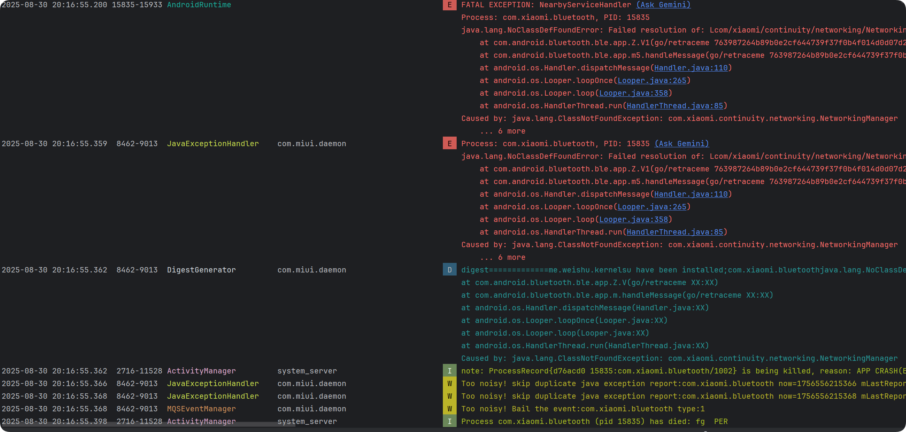
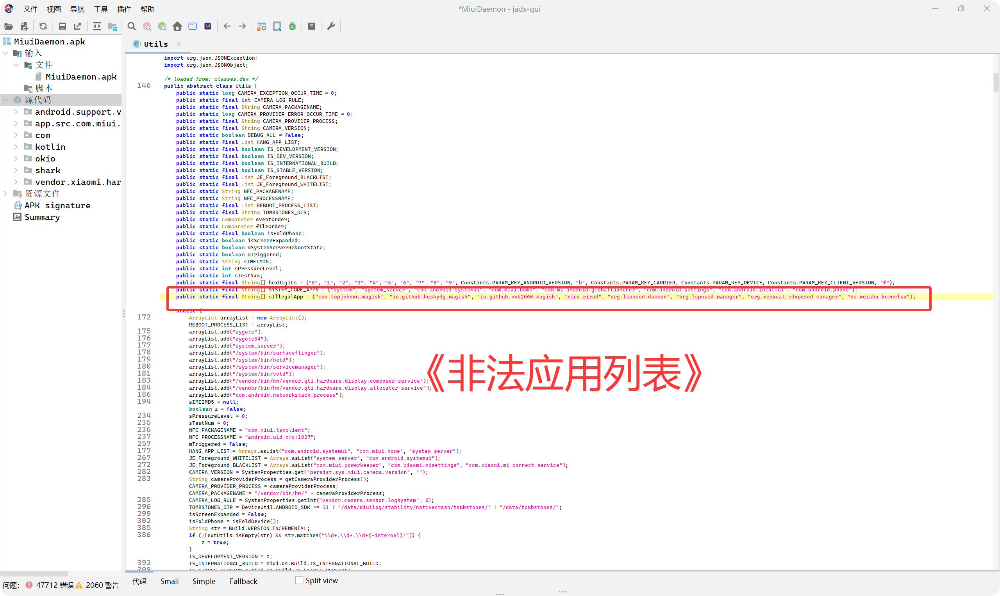
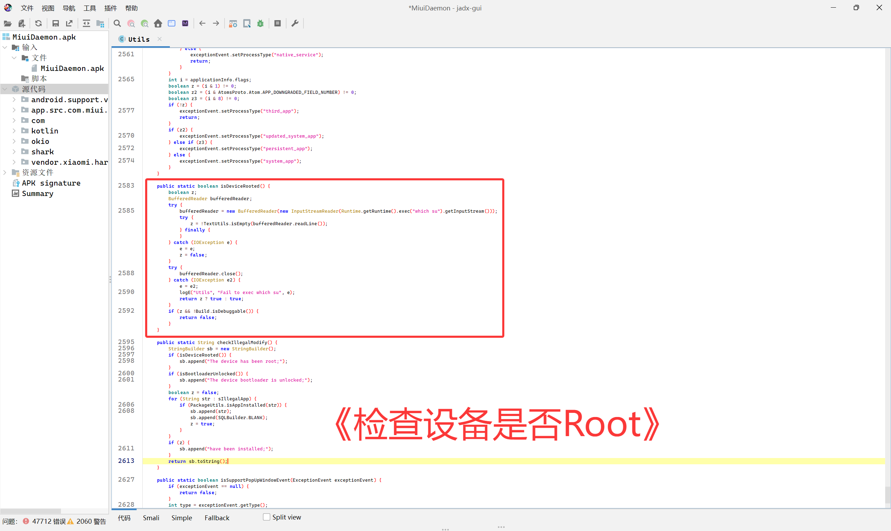
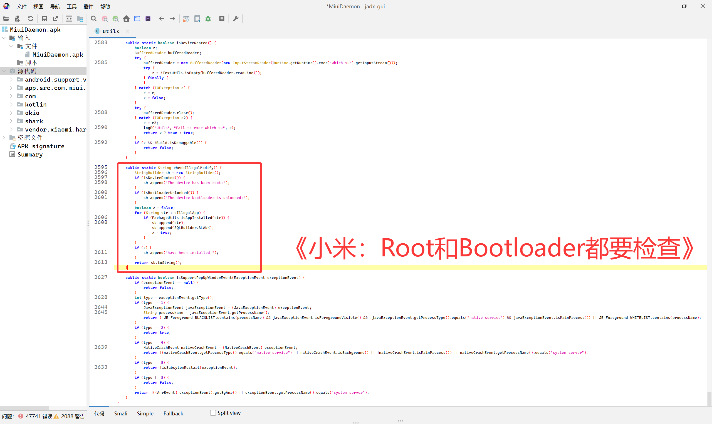

# 关于小米HyperOS3 增加检查 Root Bootloader 这档事

## 起因

起因是因为我查看Bluetooth 部分的 Log，就拿 Android Stduio 看，这一看啊，太炸裂了

结果一看，com.miui.deamon，好啊好，于是我查看了 com.miui.deamon 的代码，在 Utilt 这个这个类中看到了不少东西，如下

小米这招太狠了，猕猴们一定要拿 HyperOS3 去 Root，一定要解锁 Bootloader，出问题就找小米是吧
另：异常日志会被上传至服务器，但是确实没直接影响，看样子只是不接受部分用户的日志，某些用户反馈可能也无效了，看样子可能影响OTA，应该只是检查Root
